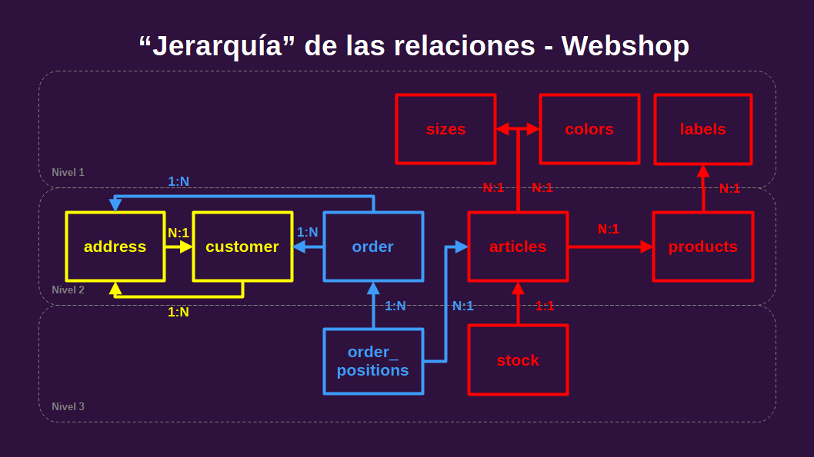

# Base de datos: Tienda Online

Copia de [PostgreSQL Sample Database](https://github.com/JannikArndt/PostgreSQLSampleDatabase), [Jannik Arndt](https://github.com/JannikArndt), con corrección de errores, para la creación de la bd desde los scripts en psql. Para la restauración desde los archivos dump ver el repositorio original.

# Instrucciones

- **Opcion A: Un solo archivo.**
  - Descargue el archivo CREATE_ALL.sql en ./BBDD/unificada

  - Copie y pegue `\i 'ruta/CREATE_ALL.sql'` en psql reemplazando ruta por la dirección correspondiente a su ubicación en su PC.

- **Opcion B: Varios archivos.**
   - Descargue el directorio ./BBDD/modificada
 
   - Ejecute uno a uno (en el orden especificado):
     - `\i './modificada/CREATE_TABLES.sql'`
     - `\i './modificada/CREATE_COLORS.sql'`
     - `\i './modificada/CREATE_SIZES.sql'`
     - `\i './modificada/CREATE_LABELS.sql'`
     - `\i './modificada/CREATE_PRODUCTS.sql'`
     - `\i './modificada/CREATE_STOCK.sql'`
     - `\i './modificada/CREATE_ADDRESS.sql'`
     - `\i './modificada/CREATE_CUSTOMERS.sql'`
     - `\i './modificada/CREATE_ORDERS.sql'`

- **Opcion C: Original.**
  - Descargue el directorio ./BBDD/original
 
  - Ejecute uno a uno (atento a los pasos intermedios):
     - `\i './original/CREATE_TABLES.sql'`
     - `\i './original/CREATE_COLORS.sql'`
     - `\i './original/CREATE_SIZES.sql'`
     - `\i './original/CREATE_LABELS.sql'`
     - Reemplazar size (línea 127) por sizeid en CREATE_PRODUCTS.sql
     - `\i './original/CREATE_PRODUCTS.sql'`
     - `\i './original/CREATE_STOCK.sql'`
     - En el archivo CREATE_ADDRESS.sql:
       - Eliminar NULL (línea 1001)
       - Convertir de Windows 1252 a UTF-8 
       - Eliminar foránea restrictiva (desde psql): `ALTER TABLE webshop.address DROP CONSTRAINT address_customerid_fkey; `
       - Restablecer la foránea (paso opcional, para lo cual deberá eliminar los registros conflictivos): `ALTER TABLE webshop.address ADD CONSTRAINT fk_address_to_customer FOREIGN KEY (customerId) REFERENCES webshop.customer (id);`
     - `\i './original/CREATE_ADDRESS.sql'`
     - `\i './original/CREATE_CUSTOMERS.sql'`
     - Reemplazar customer (línea 14) por customerId en CREATE_ORDERS.sql
     - `\i './original/CREATE_ORDERS.sql'`

# Tabla comparativa

BD/ Características  | Libre de errores | Integridad | Uso recomendado
------------- | ------------- | ------------- | -------------
Unificada  | Sí | Mala. Caracteres extraviados  | Poco tiempo para examinar detalles
Modificada | Sí | Mala. Caracteres extraviados | Visualizar mejor si existen conflictos
Original | No | Fidedigna | Depurar manualmente

# Diagrama

Nota: Si no emplea su original la llave foránea address -> customer está rota.
[Más información sobre las relaciones](https://github.com/urielhdz/sql-workshop/blob/main/schema.md), por [Uriel Hernández](https://github.com/urielhdz), [Código Facilito](https://github.com/codigofacilito).
